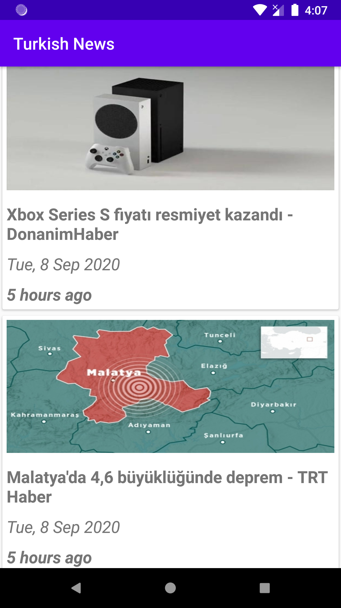

<h2 align="center">
Android News App
</h2>

## Application About

 
This app pulls news from the news api.

 - [Data Binding](https://developer.android.com/topic/libraries/data-binding)
 - [View Binding](https://developer.android.com/topic/libraries/view-binding)
 - [ViewModel](https://developer.android.com/topic/libraries/architecture/viewmodel)
 - [Lifecycle](https://developer.android.com/guide/components/activities/activity-lifecycle)
 - [LiveData](https://developer.android.com/topic/libraries/architecture/livedata)
 
  

### News Api
[News Api](https://newsapi.org/) is a simple and easy-to-use API that returns JSON metadata for headlines and articles live all over the web right now.
  
### Libraries
- [Logging Interceptor](https://github.com/square/okhttp/tree/master/okhttp-logging-interceptor) An OkHttp interceptor which logs HTTP request and response data.
- [Retrofit2 & OkHttp3](https://github.com/square/retrofit) - construct the REST APIs and paging network data.
- [Glide](https://github.com/bumptech/glide) - Glide is a fast and efficient open source media management and image loading framework for Android that wraps media decoding, memory and disk caching, and resource pooling into a simple and easy to use interface.
- [Prettytime](https://github.com/ocpsoft/prettytime) Social Style Date and Time Formatting for Java.
